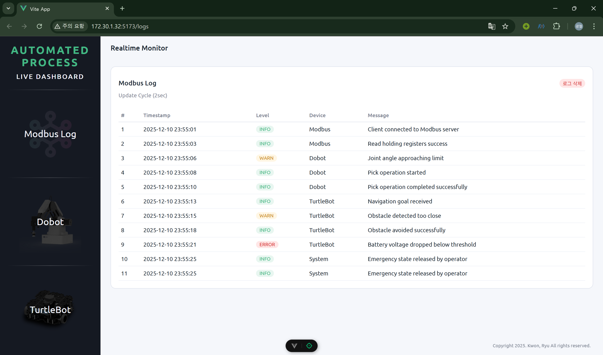
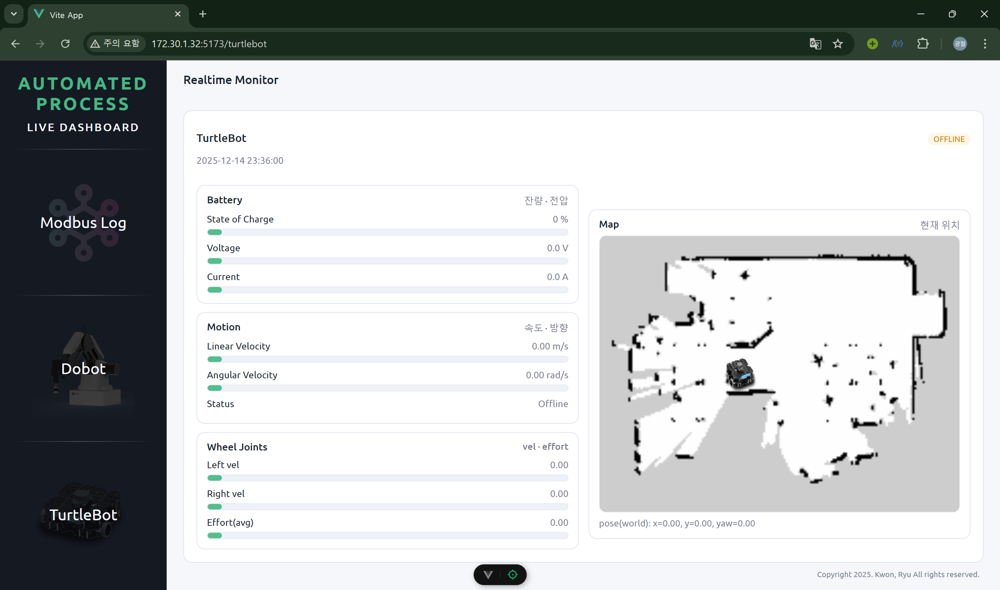
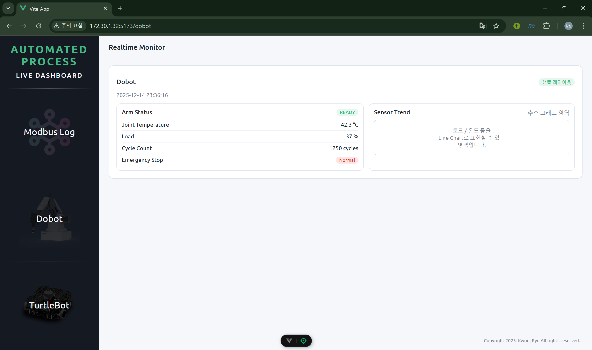

# 🗓️ X_Week MINUTE / 25.12.14

## ✅ 1. Done

권순재 - LSTM Data Train(Apple 주가 데이터), AI 모델 학습 완료, MPU Data 공부

류광철 - Web page 구현

- 로그 페이지
- Turtlebot ros topic(전류 전압 배터리 잔량 등) 받아서 실시간 관제

## 🗒️ 2. Evidence

류광철

## ⚠️ 3. Issues / Improvements

- 로그 데이터 포맷 수정
- Dobot MPU5060 데이터 전송 루트 (AI 모델, 웹)

## 💪 4. Decisions

- 로그 데이터 포맷 정하기 -> 맞춰서 웹도 수정
- Dobot MPU5060 데이터 수발신 방법 고안

## 📊 5. Progress

- 공정 (95%)
- 웹 구현 (70%)
- 예방진단 (40%)

## 🎯 6. Next Goals

### 가장 큰 목표는 웹과 예방진단 계획!!!

권순재

- ESP NOW (ESP 끼리 Wifi 없이 통신하는 방법) 공부 - Dobot에 부착한 MPU5060 6개의 값 넘겨서 AI 모델에 학습

- 학습된 AI 모델로 실시간 추론하는 시스템 구현, 예방진단 논리 연결

류광철

웹 페이지 구현

- Dobot 센서 값 받아서 그래프로 표현하는 페이지 (받고 표현하는 방법 고안 후 구현)
