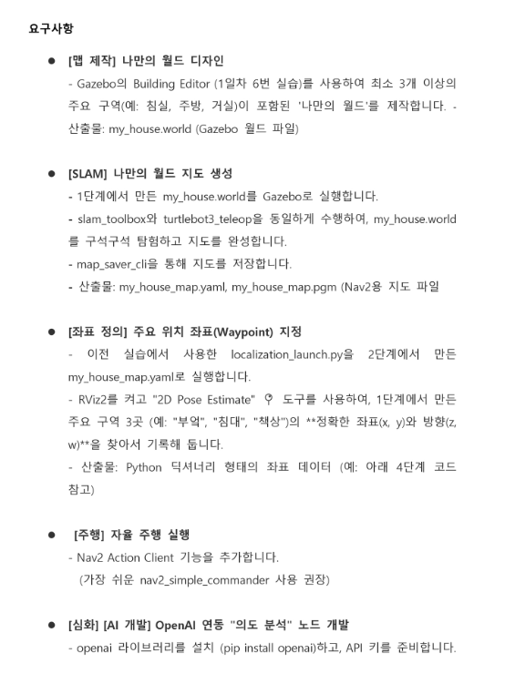
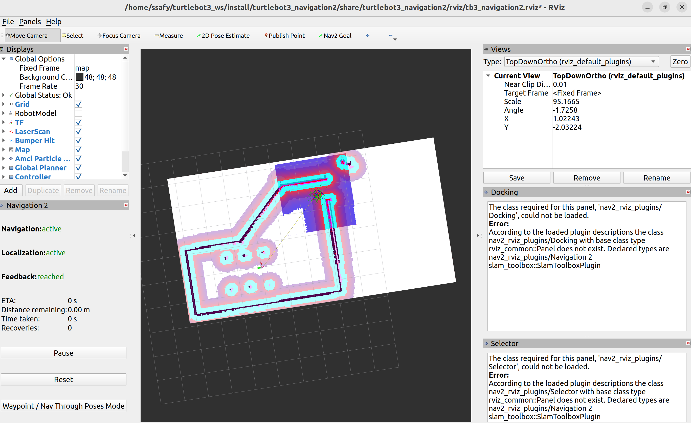

# SLAM

# 1. 목표

- Gazebo Building Editor, slam_toolbox를 사용하여 커스텀 월드 제작
- Nav2를 통한 AMCL(위치 추정) 완료 및 자율 주행 목표 전단
- OpenAI API를 python 노드에서 호출하여 로봇 제어 명령 생성

---

# 2. 준비사항


- 개발언어 및 툴
    - Python3 / ROS 2 Humble / Gazebo / RViz2 / Ubuntu 22.04 / VSCode
- 필수 라이브러리 / 오픈소스
    - OpenAI API / Nav 2(Nav2_bringup, slam_toolbox, acml) 등

---

# 3. 요구사항




---

# 4. 진행과정


## 1. Gazebo 가상환경 생성


[map.world](attachment:a1438186-89a8-4bae-bd2e-65ce6157c414:map.world)

### Launch 파일 작성

```python
## 터미널 1
## cd (작업 중 폴더)/
## source ~/.bashrc
## ros2 launch ./run_map.launch.py

import os
from ament_index_python.packages import get_package_share_directory
from launch import LaunchDescription
from launch.actions import IncludeLaunchDescription
from launch.launch_description_sources import PythonLaunchDescriptionSource
from launch.substitutions import LaunchConfiguration

def generate_launch_description():
    launch_file_dir = os.path.join(get_package_share_directory('turtlebot3_gazebo'), 'launch')
    pkg_gazebo_ros = get_package_share_directory('gazebo_ros')

    use_sim_time = LaunchConfiguration('use_sim_time', default='true')

    # 로봇 스폰 위치 수정
    x_pose = LaunchConfiguration('x_pose', default='0') # DEFAULT 값을 수정하세요
    y_pose = LaunchConfiguration('y_pose', default='0') # DEFAULT 값을 수정하세요

    # .world 파일을 같은 해당 run_my_house.launch.py 파일과 같은 위치에 두세요
    current_dir = os.path.dirname(os.path.realpath(__file__))

    world = os.path.join(
        current_dir,
        'map.world' # 사용하는 .world 파일 이름으로 교체
    )

    gzserver_cmd = IncludeLaunchDescription(
        PythonLaunchDescriptionSource(
            os.path.join(pkg_gazebo_ros, 'launch', 'gzserver.launch.py')
        ),
        launch_arguments={'world': world}.items()
    )

    gzclient_cmd = IncludeLaunchDescription(
        PythonLaunchDescriptionSource(
            os.path.join(pkg_gazebo_ros, 'launch', 'gzclient.launch.py')
        )
    )

    robot_state_publisher_cmd = IncludeLaunchDescription(
        PythonLaunchDescriptionSource(
            os.path.join(launch_file_dir, 'robot_state_publisher.launch.py')
        ),
        launch_arguments={'use_sim_time': use_sim_time}.items()
    )

    spawn_turtlebot_cmd = IncludeLaunchDescription(

        PythonLaunchDescriptionSource(
            os.path.join(launch_file_dir, 'spawn_turtlebot3.launch.py')
        ),
        launch_arguments={
            'x_pose': x_pose,
            'y_pose': y_pose
        }.items()
    )

    ld = LaunchDescription()

    # Add the commands to the launch description
    ld.add_action(gzserver_cmd)
    ld.add_action(gzclient_cmd)
    ld.add_action(robot_state_publisher_cmd)
    ld.add_action(spawn_turtlebot_cmd)

    return ld 
```

## 2. Rviz로 Map Save



```python
# 실물 turtlebot으로 할 때 명령어
ros2 launch turtlebot3_bringup robot.launch.py
# cartographer로 맵 그리기
ros2 launch turtlebot3_cartographer cartographer.launch.py
# teleop으로 이동하며 맵 그리기

# 저장한 Map으로 Nav2 실행
ros2 launch turtlebot3_navigation2 navigation2.launch.py use_sim_time:=True map:=$HOME/my_map.yaml
```

[my_map.yaml](attachment:977ff2f1-1c04-4844-9e81-42a86ad9a063:my_map.yaml)

## 3. 물류 자동화 Python Code

```python
import rclpy
from nav2_simple_commander.robot_navigator import BasicNavigator, TaskResult
from geometry_msgs.msg import PoseStamped
import time
import file_A

WORK_ROUTE = {
    "work_target": [2.9, -4.12, 0.0, 1.0],
    "work_init": [-0.0321, -0.908, 0.0, 1.0],
}

def go_to(navigator, pose):
    navigator.goToPose(pose)
    while not navigator.isTaskComplete():
        pass

def make_pose(x, y, w, navigator):
    goal = PoseStamped()
    goal.header.frame_id = 'map'
    goal.header.stamp = navigator.get_clock().now().to_msg()
    goal.pose.position.x = x
    goal.pose.position.y = y
    goal.pose.orientation.w = w
    return goal

def main():
    rclpy.init()
    navigator = BasicNavigator()
    navigator.waitUntilNav2Active()
    print("Nav2 is Ready!")

    while True:
        time.sleep(1)
        file_A.count += 1

        if file_A.count >= 5:
            print("Box is full. Dropping mini boxes.")

            x, y, _, w = WORK_ROUTE["work_target"]
            target_pose = make_pose(x, y, w, navigator)
            go_to(navigator, target_pose)

            print("Arrived. Preparing to unload all mini boxes.")
            time.sleep(30)

            print("Resuming mission. Heading back to collect boxes.")

            x, y, _, w = WORK_ROUTE["work_init"]
            init_pose = make_pose(x, y, w, navigator)
            go_to(navigator, init_pose)

            print("Waiting until box count reaches 5.")
            file_A.count = 0

        else:
            continue

    exit(0)

if __name__ == '__main__':
    main()

```

```python
# 실행 명령어
python3 pjt.py --ros-args -p use_sim_time:=true
```